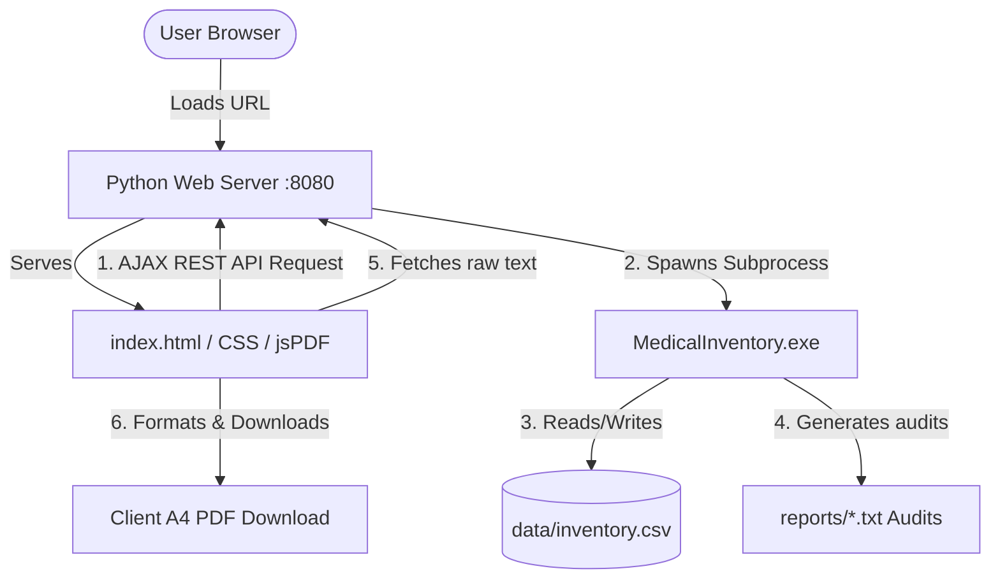

# MIMS — Medical Inventory Management System

<p align="center">
  
</p>

<p align="center">
  
  
  

</p>

---

## 📌 Table of Contents
1. [Overview & Project Description](#-overview--project-description)
2. [Project Objective](#-project-objective)
3. [Key Features](#-key-features)
4. [Technology Stack](#-technology-stack)
5. [System Architecture](#-system-architecture)
6. [Codebase Directory Structure](#-codebase-directory-structure)
7. [Prerequisites](#-prerequisites)
8. [Installation & Setup](#-installation--setup)
9. [Running the Application](#-running-the-application)
10. [Application User Guide](#-application-user-guide)
11. [Generating Reports & Monospace PDFs](#-generating-reports--monospace-pdfs)
12. [Troubleshooting Guide](#%EF%B8%8F-troubleshooting-guide)
13. [Future Enhancements](#-future-enhancements)
14. [License](#-license)

---

## 📖 Overview & Project Description

**MIMS (Medical Inventory Management System)** is a highly optimized, dual-engine hybrid desktop/web application tailored for small-to-medium clinics, pharmacies, and medical stores. 

Traditional inventory tools are often either slow web interfaces or hard-to-use console programs. MIMS bridges this gap by combining a **compiled C++ database engine** with an **elegant, hardware-accelerated Tailwind CSS web dashboard**. A lightweight Python server serves the frontend assets and forwards web operations to the C++ core backend via subprocess execution, creating a unified, secure, and user-friendly experience.

---

## 🎯 Project Objective

In healthcare, managing inventory accurately is a critical task. Stocking expired medications or running out of essential drugs can have severe consequences. MIMS is designed to solve these issues by:
*   **Preventing Waste**: Proactively identifying expiring and expired medicine batches before they are dispensed.
*   **Ensuring Availability**: Alerting administrators in real-time when stock levels drop below custom thresholds.
*   **Ensuring Data Portability**: Using standard flat-file formats (`.csv` and `.txt`) to keep inventory records lightweight, portable, and easy to back up.
*   **Simplifying Developer Operations**: Providing a single-command environment (`run.py`) to compile backend modifications and spin up local network hosts instantly.

---

## ✨ Key Features

*   **Unified Dev Server Launcher**: A Python orchestrator (`run.py`) compiles the C++ files (using `g++` if installed) and boots the HTTP server in a single terminal command.
*   **Dual-Engine Architecture**: Uses native C++ for file database operations and Python for web hosting and REST routing.
*   **Modern SPA Web Portal**: High-fidelity dark mode dashboard with Tailwind CSS, custom HSL teal accents, KPI metrics cards, and smooth modal animations.
*   **Granular Inventory Console**: Operations to add new batches, adjust quantities (delta +/- offsets), modify expiration dates, and delete batches permanently.
*   **Interactive Status Indicators**: Visual status badges for "Healthy", "Low Stock", "Out of Stock", and "Expired" listings.
*   **Monospace PDF Audits**: Export inventory audits to PDF format with alignment preserved using Courier monospace typography.
*   **Dual-Protocol API Fallback**: The client-side automatically detects if the HTML is opened as a local file (`file://`) and routes API requests to `http://localhost:8080`, allowing offline browser runs.

---

## 🛠️ Technology Stack

| Layer | Component | Technology | Purpose |
| :--- | :--- | :--- | :--- |
| **Frontend** | Interface | **HTML5 / Vanilla CSS** | Structure and custom styling tokens |
| **Frontend** | Layout Framework | **Tailwind CSS** (via CDN) | Modern responsive utility layout grid |
| **Frontend** | PDF Engine | **jsPDF** (via CDN) | Client-side vector PDF generation and browser download |
| **Middleware** | Web Server | **Python 3 (Standard Library)** | Custom HTTP API server, socket handling, and CORS middleware |
| **Backend Core** | Database Engine | **C++17 (G++ compiled)** | File system operations, calculations, and text reports generator |
| **Database** | File Storage | **CSV Flat File** | Local file database (`data/inventory.csv`) |

---

## 📐 System Architecture



---

## 📁 Codebase Directory Structure

The codebase is organized logically, separating the core C++ engine, Python server, and frontend web assets:

```text
Medical Inventory Management/
│
├── Main.cpp                    # C++ Entry point: decodes command line arguments and routes execution
├── medicine.cpp / .hpp         # C++ Class: represents single medicine items, batches, and values
├── inventory.cpp / .hpp        # C++ Class: manages list collections of medicines, filters low stock & expired
├── storage.cpp / .hpp          # C++ Operations: parses and saves medicine list data to csv file
├── search.cpp / .hpp           # C++ Operations: matches listings by name or batch ID
├── reports.cpp / .hpp          # C++ Generator: builds audit texts for low stock/expiry alerts
├── date_utils.cpp / .hpp       # C++ Helpers: formats dates and calculates differences against system time
├── login.cpp / .hpp            # C++ Validator: handles administrator credential validation
│
├── MedicalInventory.exe        # Pre-compiled native C++ backend binary
│
├── gui/
│   ├── gui.py                  # Python web server: hosts static files and serves API routes
│   └── web/
│       └── index.html          # Web Frontend: Single Page Dashboard (HTML, Tailwind CSS, JS logic)
│
├── data/
│   └── inventory.csv           # Flat-file database containing inventory records
│
├── reports/                    # Target directory for generated text reports (*.txt)
│
├── run.py                      # Root launcher script (handles compilation and starting web server)
├── mims_banner.png             # GitHub Repository brand banner image
└── README.md                   # Repository documentation
```

---

## ⚙️ Prerequisites

To run or build MIMS locally, you need:
1.  **Python 3.8 or higher** (Ensure `python` is added to your Environment system PATH).
2.  **g++ Compiler** (Supports C++17. If not found, `run.py` will use the pre-compiled `MedicalInventory.exe` executable).
3.  A modern web browser (Google Chrome, Mozilla Firefox, Microsoft Edge, Safari).

---

## 🚀 Installation & Setup

1.  **Clone the Repository**:
    ```bash
    git clone https://github.com/yourusername/medical-inventory-management.git
    cd medical-inventory-management
    ```
2.  **Verify python installation**:
    ```bash
    python --version
    ```
3.  **Ensure database directories exist**:
    The system will automatically initialize the `data` and `reports` folders upon running, but you can confirm their existence in the root directory.

---

## 🏃 Running the Application

To boot up the complete stack:
1.  Open your terminal in the root directory of the cloned project.
2.  Run the launcher script:
    ```bash
    python run.py
    ```
3.  **Review the terminal output**:
    *   The launcher checks for `g++` and recompiles the codebase if changes are made to C++ files.
    *   It binds the Python HTTP server to port `8080` (or fails gracefully if the port is busy).
4.  The application will automatically launch a new tab in your default web browser pointing to:
    ```text
    http://localhost:8080
    ```

---

## 👤 Application User Guide

### 1. Authentication
*   Open the browser interface.
*   In the Admin Login overlay, enter your administrator credentials (validated against `auth.txt` via C++ subprocess execution).
*   Upon successful authorization, the main dashboard will fade in.

### 2. Monitoring & Filtering
*   **KPI Metric Cards**: Review total listings, low stock notifications, expired counts, and the total monetary value of current stock.
*   **Filter Views**: Toggle the sidebar buttons to filter the inventory display:
    *   *All Medicines*: Displays every batch folder.
    *   *Low Stock Alerts*: Displays medicines whose quantities are at or below their thresholds.
    *   *Expired Inventory*: Lists batches that have passed their expiration dates.
*   **Quick Search**: Type in the top header search bar to filter listings by medicine name in real-time.

### 3. Modifying Records
*   **Select Item**: Click any row in the *Stock Directory* table to auto-populate the Console Operations forms.
*   **Form Operations**:
    *   *Add*: Go to the **Add** tab, enter batch specifics, and click *Add New Medicine*.
    *   *Qty (Adjust)*: Select the **Qty** tab, input a positive/negative delta number (e.g. `100` or `-50`), and click *Update Quantity*.
    *   *Expiry (Correct)*: Go to the **Expiry** tab, type a new date (`YYYY-MM-DD`), and click *Modify Expiry Date*.
    *   *Delete*: Under the **Delete** tab, click *Delete Selected Batch* to permanently wipe out the record.

---

## 📄 Generating Reports & Monospace PDFs

1.  On the sidebar navigation under **Automated Actions**, click **Generate Expired Report** or **Generate Low Stock Report**. This runs C++ logic to write a text report file in the `reports/` folder.
2.  Navigate to **Report Directories** -> **Expired Reports** or **Low Stock Reports** in the sidebar.
3.  The list will update to show the generated files sorted by date.
4.  **Export Options**:
    *   Click **View** to inspect the text output inside the modal window.
    *   Click **PDF** directly from the list, or click **Download PDF** inside the view modal.
    *   A vector A4 PDF will download to your local system, rendering the report in a Courier monospace font to ensure table lines and alignment are perfectly preserved.

---

## 🛠️ Troubleshooting Guide

### 1. Connection Error: Make sure Python server is running
*   **Cause**: The frontend is trying to talk to the backend on `localhost:8080`, but the server is stopped or blocked.
*   **Solution**: Run `python run.py` in your terminal. If you opened `index.html` as a local file (`file:///...`), keep the python server terminal running in the background.

### 2. Server execution error: [Errno 10048] Address already in use
*   **Cause**: Another process is already running on port `8080`.
*   **Solution**: Stop any active instances of `gui.py` or other servers running on port 8080. Alternatively, open `gui/gui.py` and modify `PORT = 8080` to an open port (e.g., `8090`).

### 3. C++ compiler (g++) not found in system PATH
*   **Cause**: You do not have MinGW, MSVC, or Clang installed or added to your PATH environment variables.
*   **Solution**: This is a non-breaking warning. The launcher script will automatically skip compilation and run the application using the pre-compiled `MedicalInventory.exe` binary.

---

## 🔮 Future Enhancements

*   **Data Visualization**: Integration of charting libraries (e.g. Chart.js) to display stock levels and monthly expiration trends visually.
*   **Supplier & Contact logs**: Add database columns linking medication batches to supplier logs for faster replenishment.
*   **Pharmacy Roles**: Multi-tier permissions (e.g. basic cashier access for quantity adjustment only, admin role for audit generation and item deletions).
*   **Visual Alert Indicators**: Audio warnings and notification badges on the UI when vital medicines hit zero stock.

---


