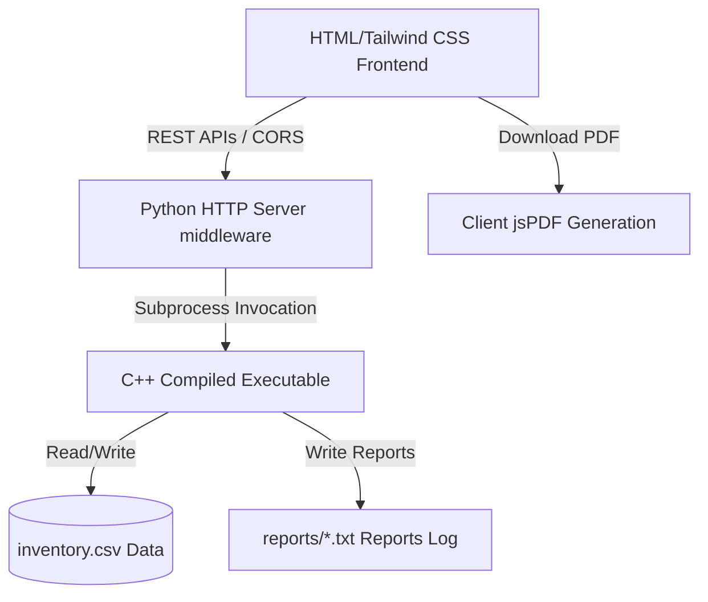

# MIMS — Medical Inventory Management System

MIMS is a modern, full-stack hybrid web portal designed to streamline medical inventory, expiration tracking, and low-stock alerting. It integrates a **high-performance C++ backend** with a **responsive HTML/CSS/JS frontend** served via a **Python HTTP middleware API server**.

---

## 🌟 Key Features

*   **Unified Run Script**: Compile C++ source files and boot the local server in a single command (`python run.py`).
*   **Dual-Core Architecture**: High-speed C++ logic handles data storage and processing, while Python handles REST API routing and serves the static assets.
*   **Modern Dashboard**: Premium dark-mode user interface built with Tailwind CSS, custom micro-animations, dynamic KPI cards, and custom scrollbars.
*   **Advanced Filtering**: View all inventory, view only low stock warnings, or track expired items instantly.
*   **Automated Reports**: Generate low-stock alerts and expired-medicine reports locally via C++ operations.
*   **Monospace PDF Exports**: Download generated text reports directly as PDF files with layout alignments preserved using client-side `jsPDF` integration.
*   **Dual Protocol Compatibility**: Runs seamlessly on a local network or via double-clicking the static `index.html` file using an automatic API protocol fallback.

---

## 📂 Project Architecture



*   **`Main.cpp` / C++ Modules**: Handles authentication, item updates, threshold warnings, and exports reports.
*   **`gui/gui.py`**: A clean, zero-dependency Python HTTP server that exposes endpoints (e.g. `/api/inventory`, `/api/execute`) and communicates with the C++ backend.
*   **`gui/web/index.html`**: A highly interactive, beautiful SPA (Single Page Application) that communicates with the Python API.
*   **`run.py`**: The main project orchestrator that checks tools, builds/compiles source code, and boots the environment.

---

## 🚀 Getting Started

### Prerequisites
*   **Python 3.6+** (for the web server and launcher)
*   **g++ Compiler** (optional; the launcher will automatically use the pre-compiled `MedicalInventory.exe` if `g++` is not installed)

### Running the Application (Single Command)
Navigate to the project root directory and run:
```powershell
python run.py
```
This script will:
1. Detect your `g++` compiler and rebuild the backend binary `MedicalInventory.exe` (if compiler is present).
2. Start the local server on `http://localhost:8080`.
3. Automatically open your default browser to launch the web dashboard.

*Note: If the server is running in the background, you can also double-click `gui/web/index.html` to run the portal as a local file, and it will safely connect to the backend.*

---

## 💻 Console Operations

Inside the console drawer, you can perform administrative actions:
*   **Add**: Insert new medicine batches with expiry dates, prices, quantities, and threshold levels.
*   **Qty**: Modify inventory counts by adding positive or negative quantity adjustments.
*   **Expiry**: Correct or update existing batch expiration dates.
*   **Delete**: Permanently wipe out inventory records for selected batches.

---

## 📄 Generating & Downloading Reports

1. Expand the **Automated Actions** section on the sidebar.
2. Click **Generate Expired Report** or **Generate Low Stock Report**.
3. Go to **Report Directories** -> **Expired Reports** or **Low Stock Reports** to see your logs.
4. Click **PDF** next to a report or open **View** and click **Download PDF** to export a clean A4 PDF of the report.

---

## 🛠️ GitHub Commit Workflow

Stage and commit changes to your repository with:
```bash
# Stage changes
git add run.py gui/web/index.html README.md

# Commit
git commit -m "feat: enhance readme and integrate launcher script with PDF download support"

# Push to Github
git push origin main
```
